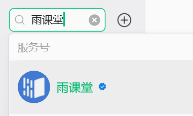
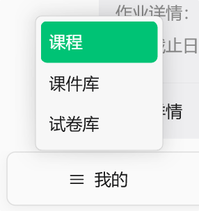
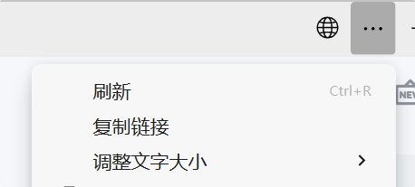
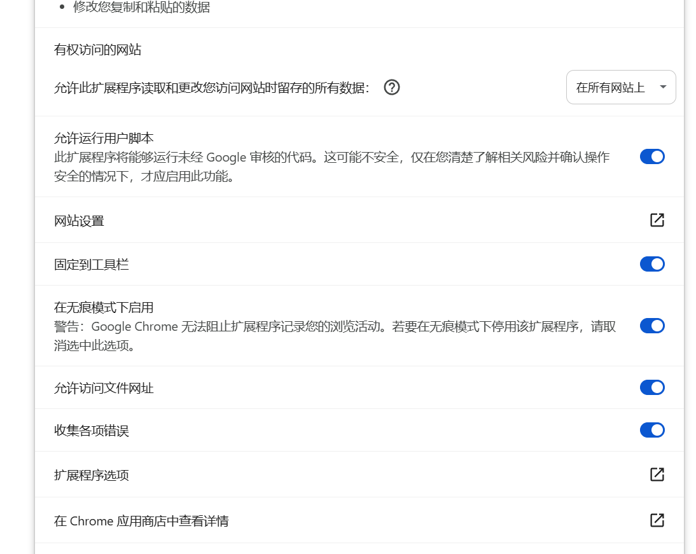

# 雨课堂挂机脚本

这是一个用于雨课堂的挂机辅助脚本集合，包含了大纲页多开协调和视频自动播放加速的功能。

## 目录
- [如何获取课程链接](#如何获取课程链接)
- [如何安装和启动脚本](#如何安装和启动脚本)
- [脚本说明](#脚本说明)

## 如何获取课程链接
如果您在电脑端无法直接找到对应的课程，可以通过微信端获取链接并在电脑浏览器中打开：

1. **进入微信服务号**：在微信搜索“雨课堂”，点击进入服务号“雨课堂”。

2. **找到课程**：在底部菜单点击“我的”，找到您要观看的课程并点击进入。

3. **复制链接**：在课程页面右上角点击菜单，选择“复制链接”。

4. **浏览器中打开**：将复制的链接发送到电脑，并在电脑浏览器中粘贴打开，登录后选择自己要刷的课程。

## 如何安装和启动脚本

### 第一步：安装脚本管理器
为了使用本脚本，您需要一个支持用户脚本（UserScript）的浏览器扩展程序。
推荐使用 **Tampermonkey**（篡改猴）：
- [Chrome 商店下载链接](https://chrome.google.com/webstore/detail/tampermonkey/dhdgffkkebhmkfjojejmpbldmpobfkfo)
- [Edge 商店下载链接](https://microsoftedge.microsoft.com/addons/detail/tampermonkey/iikmkjmpaadaobahmlepeloendndfphd)

### 第二步：安装脚本
安装好 Tampermonkey 扩展后，您可以直接点击下方链接安装脚本（建议**鼠标中键点击**或**右键选择在新标签页中打开**，以免覆盖当前页面）：

1. **[👉 点击安装：1_大纲页多开协调器](https://raw.githubusercontent.com/nbstarhkc/yuketang_tool/main/1_%E5%A4%A7%E7%BA%B2%E9%A1%B5%E5%A4%9A%E5%BC%80%E5%8D%8F%E8%B0%83%E5%99%A8.user.js)**
2. **[👉 点击安装：2_视频自动播放加速助手](https://raw.githubusercontent.com/nbstarhkc/yuketang_tool/main/2_%E8%A7%86%E9%A2%91%E8%87%AA%E5%8A%A8%E6%92%AD%E6%94%BE%E5%8A%A0%E9%80%9F%E5%8A%A9%E6%89%8B.user.js)**

   > **💡 提示**：点击安装链接后，浏览器可能会先短暂显示全是代码的页面，这是正常的。只需稍微等待几秒钟，Tampermonkey 安装界面就会自动弹出来。

### 第三步：配置扩展选项
在浏览器的扩展管理中，打开 Tampermonkey（篡改猴）的扩展详情页面，确保**开启相关的运行权限**（如图所示的选项都需要打开），否则脚本可能无法正常工作：

### 第四步：启动运行
1. 确保两个脚本在浏览器的 Tampermonkey 管理面板中都处于 **“启用”** 状态。
2. 回到您在浏览器中打开的雨课堂课程页面，**先刷新一下页面**。
3. 稍微等待几秒，直到页面上出现**脚本的控制图标或菜单**。
4. 点击课程列表上方的 **“未完成”** 选项。
5. 最后，点击**脚本的图标/开始按钮**，脚本就会自动处理未完成的任务啦！

## 脚本说明
- **1_大纲页多开协调器.user.js**: 负责在课程大纲页面协调多个任务的执行，辅助多开。
- **2_视频自动播放加速助手.user.js**: 负责进入视频页面后，自动播放视频、处理弹题、并按设定进行加速。

## 常见问题 (FAQ)

**Q: 脚本自动连开多个视频窗口时，被浏览器拦截了怎么办？**
**A**: 这是浏览器的默认安全机制（防止网页恶意弹窗）。当脚本尝试开新窗口被拦截时，浏览器的地址栏右侧会出现一个**带有红色叉号的拦截图标**。您只需要：
1. 点击那个被拦截的图标。
2. 选择 **“始终允许 https://*.yuketang.cn 的弹窗和重定向”**。
3. 点击完成，然后刷新页面重新启动脚本即可。

## 核心技术特性
本项目采用了多种高级前端对抗技术来保障挂机的稳定性和高效率：

1. **深度 Vue 数据流拦截**：彻底抛弃脆弱的 DOM 爬取，直接通过 `__vue__` 实例底层抽取课程数据，精准识别真实进度。
2. **底层网络心跳伪装**：通过重写 `XMLHttpRequest` 和 `fetch`，在发往服务器的最后一刻对网络包进行拦截和数据篡改，安全伪装播放倍速（锁定合法倍速心跳），防检测。
3. **双重防休眠守护**：
   - 采用 **Web Audio API** 持续输出极低音量音频流保持页面活跃。
   - 采用 **Web Worker** 驱动独立的后台定时器，彻底绕过 Chrome/Edge 浏览器对后台非活动标签页的休眠限制（Throttling），保证挂机永不掉线。
4. **智能并发控制**：在主控端实现异步并发调度，最高维持 5 个子窗口全自动开闭流转，完成一个补充一个，防止浏览器内存溢出崩溃。
5. **异常自愈机制**：跨域级别代码注入，遇到网络卡死或播放器异常时能自动刷新页面完成自愈。

## 免责声明
> **⚠️ 警告**
> 本项目及脚本仅供编程学习和技术研究之用，请在下载后24小时内删除，请勿用于任何商业用途或违反平台规则的行为。
> 
> 使用者因过度依赖或不当使用本脚本而引起的任何纠纷、成绩作废、账号封禁或其他不良后果，均由使用者本人自行承担责任。**脚本作者不对使用该脚本产生的任何后果承担连带责任。**
> 
> 继续安装和使用本脚本，即代表您已知晓并同意本免责声明的所有条款。
